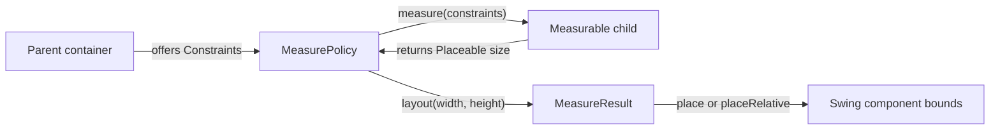
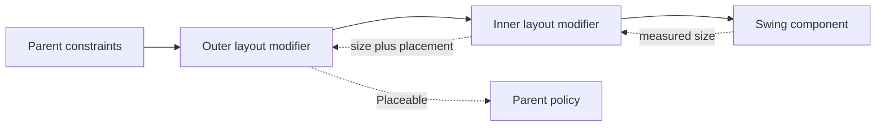

# Foundation Layout

Compose Swing UI's foundation layout API adapts the parent-driven measurement model and familiar
surface of the Jetpack Compose and Compose Multiplatform Foundation Layout module
(`androidx.compose.foundation.layout`) to real Swing components. A parent offers constraints, a child
reports a size, and the parent places it. Swing still owns the component tree, layout lifecycle, and
final bounds.

The `swing-ui-foundation` artifact owns Foundation drawing and constraint-based layout. Swing
wrappers, the composition runtime, and Swing layout-manager containers remain in `swing-ui`.

See [`COMPONENTS.md`](COMPONENTS.md#containers-and-layout) for standard Swing containers,
[`CUSTOM-CONTAINERS.md`](CUSTOM-CONTAINERS.md) to implement a container, and
[`ARCHITECTURE.md`](ARCHITECTURE.md) for the runtime.

<!--- INCLUDE .*foundation-layout-content.*
import androidx.compose.runtime.*
import org.jetbrains.compose.swing.components.*
import org.jetbrains.compose.swing.components.button.*
import org.jetbrains.compose.swing.components.layout.*
import org.jetbrains.compose.swing.foundation.layout.*
import org.jetbrains.compose.swing.modifier.*
import org.jetbrains.compose.swing.modifier.layout.*

@Composable
fun FoundationLayoutContentExample() {
----- SUFFIX .*foundation-layout-content.*
}
-->

## Layout at a glance

A layout pass has three steps:

1. The parent measures the children it needs under `Constraints` that it chooses.
2. The parent chooses its own size from the measured children and its incoming constraints.
3. The parent places each measured child inside its own inner rectangle.



This is the same parent-measures-child model used by Compose UI. Compose Swing UI adapts it to Swing's
`LayoutManager2` lifecycle and runs it on the Swing Event Dispatch Thread (EDT).

## Constraints

`Constraints` gives the minimum and maximum width and height that a child may occupy. An axis is:

- bounded when its maximum is finite;
- unbounded when its maximum is `Int.MAX_VALUE`; and
- exact when its minimum and maximum are equal. An exact axis is bounded.

Minimum values must be non-negative and cannot exceed their matching maximum. `Constraints.Unbounded`
uses zero minimums and unbounded maximums.

An exact offer fixes the child's reported extent. Foundation does not query the Swing component for
that extent; it uses the fixed width and height directly. This also means a fixed offer can bypass a
component's preferred and constrained-size queries.

The values use the same integer user-space coordinates as AWT geometry. They are not `Dp` values and
need no density conversion. AWT's graphics transform maps user-space coordinates to device pixels.

Common queries and helpers on `Constraints`:

| Member | Meaning |
|---|---|
| `hasBoundedWidth`, `hasBoundedHeight` | `true` when the axis maximum is finite (`!= Int.MAX_VALUE`). |
| `hasFixedWidth`, `hasFixedHeight` | `true` when minimum equals maximum. |
| `isZero` | `true` when both axes are fixed at zero. |
| `constrainWidth(width)`, `constrainHeight(height)` | Clamps a value into `minWidth..maxWidth` or `minHeight..maxHeight`. |
| `copy(...)` | Produces a copy with replaced extents. |

## Measurement and placement

A `MeasurePolicy` receives the container's children in declaration order as `Measurable` objects. It
measures each child, decides the container's size, and returns a `MeasureResult` with a placement
block:

```kotlin
layout(width, height) {
    first.placeRelative(0, 0)
    second.placeRelative(first.width, 0)
}
```

<!--- CLEAR -->

`Measurable.measure(constraints)` returns an immutable `Placeable` with the measured `width` and
`height`. Each call returns an independent result, so a policy may retain an earlier result while it
measures the same child again. Place the result that corresponds to the constraints the policy chose.

The placement block runs inside the container's inner rectangle, after its insets:

- `parentWidth` gives the container's inner width, and `isLeftToRight` reports its orientation.
- `place(x, y)` measures `x` from the left edge.
- `placeRelative(x, y)` measures `x` from the leading edge. It mirrors the position when the
  container's `ComponentOrientation` is right-to-left.

A policy must return a non-negative size. It should use `constraints.constrainWidth` and
`constraints.constrainHeight` when its size comes from child measurements.

## How the model connects to Swing

Swing components expose argument-less `preferredSize`, `minimumSize`, and `maximumSize` queries. They
cannot normally answer "what size do you need under these constraints?" Compose Swing UI bridges that
gap in two places.

First, each `Row`, `Column`, `Box`, and custom `Layout` creates a component that implements
`ConstrainedSize`. When a constraint-based parent measures one of these containers, it can pass the
constraints through the nested container. The child policy measures inside the child's insets, and
the child adds those insets back to the size it reports. A custom `ConstrainedSize` component records
the answer from `measure(constraints)` in `constrainedWidth` and `constrainedHeight`.

An explicit `preferredSize` on a constraint-based container is authoritative. It answers a constrained
measurement without running the container's policy.

Second, the internal layout manager maps Swing queries to the policy:

| Swing request | Policy work | Child fallback | Places children |
|---|---|---|---|
| constrained measurement by a parent | `measure` under the offered constraints | preferred size | no |
| `preferredLayoutSize` | `intrinsicSize` | preferred size | no |
| `minimumLayoutSize` | `intrinsicSize` | minimum size | no |
| `layoutContainer` | use the measured result for the current inner size, or measure that exact size | preferred size | yes |
| `maximumLayoutSize` | no policy call | unbounded on both axes | no |

### Where constraints stop

A stock Swing widget or a foreign Swing container does not implement `ConstrainedSize`. The bridge
uses its preferred or minimum size and holds that size inside the offered constraints. Such a
component cannot reflow in response to an offered width because Swing has no width-for-height child
query.

Without an explicit `preferredSize`, constraints continue through any depth of `Row`, `Column`, `Box`,
and `Layout`. They stop at a `Panel` backed by a regular Swing layout manager. Put a constraint-based
container inside that panel when its descendants need layout modifiers:

```kotlin
Panel(PanelLayout.Flow()) {
    Box {
        Label("Preview", modifier = SwingModifier.aspectRatio(16f / 9f))
    }
}
```

<!--- KNIT example-foundation-layout-content-01.kt -->

These modifiers are available only in a `ConstrainedScope`. If one reaches an incompatible manager
through relocation or another receiver, attachment is refused instead of silently ignoring it.

### Intrinsic size

Swing asks a container for preferred and minimum sizes without offering a width or height. Both
requests call `MeasurePolicy.intrinsicSize`. The child measurables answer with preferred sizes during
the preferred query and minimum sizes during the minimum query.

The default `intrinsicSize` implementation calls `measure` with `Constraints.Unbounded`. This works
for policies that do not need a finite amount of space to distribute. A policy that divides bounded
space, such as a weighted linear layout, must provide an intrinsic calculation of its own.

## Layout modifiers

`Layout`, `Row`, `Column`, and `Box` expose `ConstrainedScope`. Its modifiers participate in
measurement rather than writing a fixed Swing component property. Order matters: constraints travel
from the outermost modifier toward the component, while measured sizes and placement offsets travel
back out.



| Modifier | Measurement and placement effect |
|---|---|
| `padding(all)` | Reserves the same non-negative space around every edge. |
| `padding(horizontal, vertical)` | Reserves space on each axis. |
| `padding(start, top, end, bottom)` | Reserves logical edges. `start` and `end` mirror in right-to-left orientation. |
| `absolutePadding(left, top, right, bottom)` | Reserves physical edges and never mirrors. |
| `offset(x, y)` | Moves the child without changing the space it occupies. A positive `x` moves right in LTR and left in RTL. |
| `absoluteOffset(x, y)` | Moves the child in physical coordinates and never mirrors. |
| `aspectRatio(ratio, matchHeightConstraintsFirst)` | Chooses a width and height at the requested ratio when a bounded extent exists. Width leads by default. |
| `defaultMinSize(width, height)` | Raises an axis minimum only when the incoming minimum is zero. |

`aspectRatio` tries the bounded maxima first, then bounded minima, using width first by default or
height first when `matchHeightConstraintsFirst` is true. It first requires the derived size to satisfy
the incoming constraints. If no candidate fits, it tries the same extents without that requirement,
so the ratio can escape an impossible offer. If no bounded extent can define the ratio, it passes the
incoming constraints unchanged.

Padding also moves a component's reported text baseline, so `alignByBaseline()` remains correct
through nested padding and offsets. The container measures and places the child plus the room its
modifier chain reserved as one rectangle, so each of these reaches the child through the container
rather than by writing anything on the component.

Layout modifiers remain in the chain and apply in order. `LayoutModifier` is a public
`SwingModifier.ParentLayoutElement`; custom constraint-based containers can implement it to wrap a
child's measurement and placement. Parent-data modifiers implement `ParentDataModifier`, fold their
values in declaration order, and expose the result to a policy as `Measurable.parentData`. All
parent-layout elements use a key: a non-additive key keeps its last declaration, while additive
elements remain in order. For example, `weight(2f).weight(1f)` uses `1f`, while
`weight(1f).align(Alignment.Bottom)` keeps both declarations.

### Observing layout

Swing components can observe their laid-out geometry via modifiers:

| Modifier | What it reports |
|---|---|
| `onSizeChanged(callback)` | Delivers the component's `Dimension` after an AWT resize event when the size differs from the last report. |
| `onPlaced(callback)` | Delivers the component's `Rectangle` after an AWT move or resize event when the bounds differ from the last report. |

Both callbacks arrive on the EDT after the component takes its new geometry. A move or resize event
can therefore trigger a callback even when the other dimension did not change:

```kotlin
Box {
    Label(
        "Preview",
        modifier = SwingModifier
            .onSizeChanged { size -> println("Size: $size") }
            .onPlaced { bounds -> println("Bounds in parent: $bounds") },
    )
}
```

<!--- KNIT example-foundation-layout-content-02.kt -->

## Standard constraint-based containers

### `Row` and `Column`

`Row` arranges children horizontally in reading order. `Column` arranges them vertically from top to
bottom.

```kotlin
Column(verticalArrangement = Arrangement.spacedBy(8), horizontalAlignment = Alignment.Start) {
    Row(modifier = SwingModifier.fillMaxWidth(), horizontalArrangement = Arrangement.End) {
        Button("Back", onClick = {})
        Button("Forward", onClick = {})
    }
    Panel(PanelLayout.Flow(hgap = 8, vgap = 4), modifier = SwingModifier.weight(1f)) {
        Label("Content")
    }
    Label("Status", modifier = SwingModifier.align(Alignment.CenterHorizontally))
}
```

<!--- KNIT example-foundation-layout-content-03.kt -->

In both containers:

- unweighted children normally take the size they prefer, limited by the space left;
- `weight(value, fill)` divides remaining main-axis space in proportion to positive weights;
- `fill = true` makes a weighted child occupy its full share, while `false` lets it settle for the
  size it prefers and leaves the rest to the arrangement;
- the arrangement places unused main-axis space;
- the container alignment places children on the cross axis; and
- a child's `align` overrides the container's cross-axis alignment.

An explicit Swing `maximumSize` normally caps the extent offered to any child. A layout modifier
whose contract permits it, such as `aspectRatio` under an impossible offer, may still report an
extent outside that ceiling.

Under an unbounded main axis, there is no finite remainder to divide. Regular measurement grants
weighted children from the minimum main-axis extent. Intrinsic measurement separately determines
the size the container prefers.

#### Filling bounded space

Main-axis distribution uses weights. `fillMaxWidth(fraction)`, `fillMaxHeight(fraction)`, and
`fillMaxSize(fraction)` are `ConstrainedScope` layout modifiers: the first two fill one axis and
the last fills both. They request a fraction from `0f` through `1f` of the parent's offered maximum,
defaulting to `1f`, while staying within the offered bounds. On an unbounded axis, there is no finite
maximum to fill, so that axis is left unchanged. As with other ordered layout modifiers, its position
changes the constraints that later modifiers and the component receive.

These modifiers are available in `Row`, `Column`, `Box`, and a policy `Layout`'s content. They are not
supported directly under a Swing layout manager.

`Row` also supports `alignByBaseline()`. The baseline comes from `Component.getBaseline`. A child
that reports `-1` has no baseline and sits at the row's top edge instead of using the row's alignment.

#### Arrangements and alignments

Arrangements distribute leftover main-axis space:

- `Start`, `End`, `Top`, `Bottom`, `Center`
- `SpaceBetween`, `SpaceAround`, `SpaceEvenly`
- `spacedBy(gap)` holds a fixed pixel gap between adjacent children.
- `spacedBy(gap, alignment)` and `aligned(alignment)` align the group within leftover space.
- `Arrangement.Absolute` keeps a row's children packed left to right under either orientation. Its
  overloads that take an `Alignment.Horizontal` still resolve that alignment against the orientation.

Alignments position children along the cross axis:

- `Alignment.Horizontal`: `Start`, `CenterHorizontally`, `End`
- `Alignment.Vertical`: `Top`, `CenterVertically`, `Bottom`
- `AbsoluteAlignment`: `Left`, `Right`
- `BiasAlignment`: positions by fractional bias, where `-1f` is start/top, `0f` is center, and `1f`
  is end/bottom. Values outside that range place the child beyond the available space.
- `Alignment.Horizontal + Alignment.Vertical`: pairs two 1D alignments into a 2D `Alignment`.

An `Arrangement` receives child sizes and positions in two arrays owned and reused by the container:
read and write them within the call and retain neither.

### `Box`

`Box` stacks children in declaration order. Its size comes from the greatest width and height among
children that do not use `matchParentSize()`. Children align according to the box's
`contentAlignment` unless they declare an individual `align`:

```kotlin
Box(contentAlignment = Alignment.Center) {
    Panel(PanelLayout.Border(), modifier = SwingModifier.matchParentSize()) {}
    Label("Layered content")
    Label("Badge", modifier = SwingModifier.align(Alignment.TopEnd).zIndex(1f))
}
```

<!--- KNIT example-foundation-layout-content-04.kt -->

In `BoxScope`:

- `matchParentSize()` does not influence the box's own size. After the other children determine that
  size, the box measures the child again with fixed constraints for the resolved extent. An explicit
  Swing `maximumSize` may keep the child smaller.
- `fillMaxWidth()` and `fillMaxHeight()` expand the child to fill one bounded axis, up to an explicit
  `maximumSize`, while contributing its preferred size along the other. `fillMaxSize()` does both. On
  an unbounded fill axis, the child also keeps its preferred size.
- `zIndex(value)` controls paint and hit-test order. Children with higher values sit above lower
  values regardless of declaration order. Equal values preserve declaration order, with the later
  child on top. Multiple `zIndex` declarations add their values.

### Visibility

`Row`, `Column`, `Box`, and custom `Layout` policies measure and place a child whose Swing
`isVisible` value is `false`. The child keeps its layout space but does not paint or receive input.
Regular Swing managers differ: some reserve hidden children and others collapse them.

## Choosing a container

Use `Row`, `Column`, or `Box` for standard single-axis or stacked constraint layouts with Compose-style
weights, arrangements, and alignments.

Use `Layout` when writing a custom placement policy that participates in the constraint model. It
supplies `ConstrainedScope` to its content. [`CUSTOM-CONTAINERS.md`](CUSTOM-CONTAINERS.md) develops a
complete policy and explains custom content scopes and layout constraints.

Use `Panel(PanelLayout.Xxx)` when Swing's layout manager behavior is needed. Layout modifiers from
`ConstrainedScope` are not supported directly under Swing managers; place a `Box` or constraint-based
container at that boundary.

## Relationship to Compose UI/Foundation

`Row`, `Column`, `Box` and their shared row/column measurement policy are ported from AndroidX's
`foundation-layout`; see [`swing-ui-foundation`'s `META-INF/NOTICE`](../swing-ui-foundation/src/main/resources/META-INF/NOTICE)
for the synced version.

The model follows Compose UI, adapted to Swing:

- Geometry uses AWT integer user-space coordinates instead of `Dp` and `IntSize`.
- Layout direction comes from `ComponentOrientation`.
- Swing exposes one alignment line through `Component.getBaseline`.
- Intrinsic measurement maps to Swing's argument-less `preferredSize` and `minimumSize` queries.
- Constraints stop at components that cannot answer a constrained measurement.
- Placement ends in `Component.setBounds` on a real Swing component.
