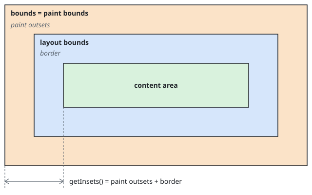

# Foundation

`swing-ui-foundation` brings androidx's parent-driven layout and its drawing surface to real Swing components: a
parent offers constraints, a child reports a size, and the parent places it; drawing and decorations paint through
Java2D. Swing still owns the component tree, the layout and paint cycles, and the final bounds.

Depend on `swing-ui-foundation` for `Row`, `Column`, `Box`, `Layout`, `Canvas` and the decoration modifiers. See
[`COMPONENTS.md`](COMPONENTS.md#containers-and-layout) for the standard Swing containers,
[`CUSTOM-CONTAINERS.md`](CUSTOM-CONTAINERS.md) to implement a container, and [`ARCHITECTURE.md`](ARCHITECTURE.md)
for the runtime.

<!--- INCLUDE .*foundation-layout-content.*
import androidx.compose.runtime.*
import org.jetbrains.compose.swing.components.*
import org.jetbrains.compose.swing.components.button.*
import org.jetbrains.compose.swing.components.layout.*
import org.jetbrains.compose.swing.foundation.graphics.*
import org.jetbrains.compose.swing.foundation.layout.*
import org.jetbrains.compose.swing.modifier.*
import org.jetbrains.compose.swing.modifier.layout.*
import java.awt.Color

@Composable
fun FoundationLayoutContentExample() {
----- SUFFIX .*foundation-layout-content.*
}
-->

## Layout

### The layout model

A layout pass has three steps:

1. The parent measures the children it needs under `Constraints` that it chooses.
2. The parent chooses its own size from the measured children and its incoming constraints.
3. The parent places each measured child inside its own inner rectangle.

This is the parent-measures-child model of Compose UI, run inside Swing's `LayoutManager2` lifecycle on the Swing
Event Dispatch Thread (EDT).

### Constraints

`Constraints` gives the minimum and maximum width and height that a child may occupy. An axis is:

- bounded when its maximum is finite;
- unbounded when its maximum is `Int.MAX_VALUE`; and
- exact when its minimum and maximum are equal. An exact axis is bounded.

Minimum values must be non-negative and cannot exceed their matching maximum. `Constraints.Unbounded`
uses zero minimums and unbounded maximums.

Under an exact offer, a component takes that size whatever its preferred, minimum or maximum size.

Sizes and positions are AWT's integer user-space coordinates, as Swing's own sizes are; the graphics transform
maps them to device pixels.

### Measuring and placing

A `MeasurePolicy` receives the container's children in declaration order as `Measurable` objects. It
measures each child, decides the container's size, and returns a `MeasureResult` with a placement
block:

```kotlin
layout(width, height) {
    first.placeRelative(0, 0)
    second.placeRelative(first.width, 0)
}
```

<!--- CLEAR -->

`Measurable.measure(constraints)` returns a `Placeable` with the measured `width` and
`height`. [Measure once](#measure-once) states how often a policy may call it.

`placeable[FirstBaseline]` reads where the child puts its first baseline, or
`AlignmentLine.UNSPECIFIED` where it has none. A policy provides lines of its own through
`layout(width, height, alignmentLines)`, and a layout modifier's line takes the place of the same line of the
content it wraps. A Foundation container's lines follow its latest measure.

The placement block runs inside the container's inner rectangle, after its insets:

- `parentWidth` gives the container's inner width, and `isLeftToRight` reports its orientation.
- `place(x, y)` measures `x` from the left edge.
- `placeRelative(x, y)` measures `x` from the leading edge. It mirrors the position when the
  container's `ComponentOrientation` is right-to-left.
- Both take a `zIndex`, `0f` by default. A child placed with a larger value paints over, and receives
  mouse events before, siblings placed with a smaller one; equal values keep declaration order, with the
  later child on top, whatever order the block places them in.
- A child the block does not place is hidden, as androidx hides it: it paints nothing, takes no mouse event and
  no focus, and Tab skips it. It is also set to a zero size, and hidden with `setVisible(false)`, as `CardLayout`
  hides its cards. `onPlaced` and `onSizeChanged` report nothing for it, or for any component a Foundation
  container lays out inside it, while it stays hidden. Placed again, it takes its placed size, is shown, and
  `onPlaced` reports its placement again for it and for every such component, as androidx re-sends a subtree's
  placement for a child that was unplaced; `onSizeChanged` reports only where a size differs from the one last
  reported. A child already hidden when left unplaced is neither hidden nor shown.

A policy must return a non-negative size. It should use `constraints.constrainWidth` and
`constraints.constrainHeight` when its size comes from child measurements.

A policy may read and write snapshot `State`. [Phases](#phases) lists what a read in each block invalidates;
`Layout`'s KDoc states what a write costs.

### Measure once

A policy measures each child at most once per pass, and only in its measure block or its placement
block; measuring the same child again, or outside both blocks, throws `IllegalStateException` with
androidx's message. A size the policy needs before it chooses a child's constraints comes from the child's
intrinsic functions, and a baseline comes from the placeable already measured, as `placeable[FirstBaseline]`. A
layout modifier may measure its inner measurable again, and each call returns an independent result.

The placement block places each child at most once per run; placing the same child twice throws
`IllegalStateException`, as in androidx. A run replayed by a placement read starts over, so it places each
child again.

### Intrinsic size

Swing asks a container for its preferred and minimum sizes without offering a width or height. A preferred size
query is answered as androidx answers `width(IntrinsicSize.Max).height(IntrinsicSize.Max)`: the policy's
`maxIntrinsicWidth` with the height unbounded, then its `maxIntrinsicHeight` at that width. A minimum size query asks
`minIntrinsicWidth` and `minIntrinsicHeight` the same way. A child answers the max functions
with its preferred size and the min functions with its minimum size, through the intrinsic functions of its layout
modifiers. By default, the intrinsic functions of a policy and of a `LayoutModifierNode` run its `measure`, as
androidx's do, against a stand-in whose extent along the asked axis is the child's intrinsic size, whatever constraints
it is measured under. A `LayoutModifierNode` whose `measure` must not run for a query, such as one that starts an
animation, overrides all four, and so does a policy that divides bounded space, such as a weighted linear layout. A
container's maximum size is unbounded unless one is set.

A `Row` or `Column` aligning a child by a line reads that line for its own size from the child's
`intrinsicPlaceable`: the line the component reports, moved or named by each `LayoutModifierNode` through its
`intrinsicPlaceable`. By default that runs the node's `measure` against a stand-in for the child and its placement
without placing anything, so the child itself is never measured. A node whose `measure` must not run for a query,
such as one that starts an animation, overrides `intrinsicPlaceable` too, alongside the four intrinsic functions, to
pass the child's stand-in through.

### Where constraints stop

An explicit `preferredSize` on a constraint-based container is authoritative: it answers a constrained
measurement without running the container's policy. Without one, constraints continue through any depth of
`Row`, `Column`, `Box` and `Layout`. A component of your own can implement `Constrainable` to answer for the
offered constraints, and name the alignment lines it provides in `alignmentLines`.

A stock Swing widget or a foreign Swing container answers with its preferred or minimum size, held inside the
offered constraints. Granted a width it does not hold, with its height left open, it is sized to that width
first, so a component whose height follows its width, such as a wrapping `TextArea`, takes its height for that width
in the same layout pass, and so does a label showing HTML. Constraints also stop at a `Panel` backed by
a Swing layout manager. Put a constraint-based container inside that panel when
its descendants need layout modifiers:

```kotlin
Panel(PanelLayout.Flow()) {
    Box {
        Label("Preview", modifier = SwingModifier.aspectRatio(16f / 9f))
    }
}
```

<!--- KNIT example-foundation-layout-content-01.kt -->

### Layout modifiers

`Layout`, `Row`, `Column` and `Box` expose `ConstrainedScope`, whose modifiers take part in measurement. Order
matters: constraints travel from the outermost modifier toward the component, while measured sizes and placement
offsets travel back out. `start` and `end` mirror under a right-to-left orientation; the `absolute` variants use
`left` and `right` and never mirror. `padding` and `offset` move the component's baseline too, so
`alignByBaseline()` stays correct through them.

`zIndex(value)` places the child at that z-index among its siblings, as `place`'s `zIndex` does; several
declarations add up, and add to the z-index the container places the child with.

A layout modifier is a `LayoutModifierNodeElement`, whose `LayoutModifierNode` wraps a child's measurement and
placement and keeps its state across passes; a child declares one of your own through `ConstrainedScope`'s `layout`
member, as [Scoped modifiers](#scoped-modifiers) shows. Parent-data modifiers such as `weight` and `align` fold in
declaration order and reach a policy as `Measurable.parentData`: `weight(2f).weight(1f)` uses `1f`, while
`weight(1f).align(Alignment.Bottom)` keeps both.
[Parent data and layout modifiers](CUSTOM-CONTAINERS.md#parent-data-and-layout-modifiers) describes these types.

### Observing layout

`onSizeChanged(callback)` delivers the component's size after its parent places it at a size that differs from the
last report, and `onPlaced(callback)` delivers its layout bounds in the parent after they change. Both arrive on the
EDT, one report for a placement that both moves and resizes the component. They report the
[layout bounds](#bounds), so paint outsets such as a shadow's change neither:

```kotlin
Box {
    Label(
        "Preview",
        modifier = SwingModifier
            .onSizeChanged { size -> println("Size: $size") }
            .onPlaced { bounds -> println("Bounds in parent: $bounds") },
    )
}
```

<!--- KNIT example-foundation-layout-content-02.kt -->

### `Row` and `Column`

`Row` arranges children horizontally in reading order. `Column` arranges them vertically from top to
bottom.

```kotlin
Column(verticalArrangement = Arrangement.spacedBy(8), horizontalAlignment = Alignment.Start) {
    Row(modifier = SwingModifier.fillMaxWidth(), horizontalArrangement = Arrangement.End) {
        Button("Back", onClick = {})
        Button("Forward", onClick = {})
    }
    Panel(PanelLayout.Flow(hgap = 8, vgap = 4), modifier = SwingModifier.weight(1f)) {
        Label("Content")
    }
    Label("Status", modifier = SwingModifier.align(Alignment.CenterHorizontally))
}
```

<!--- KNIT example-foundation-layout-content-03.kt -->

In both containers:

- unweighted children normally take the size they prefer, limited by the space left;
- `weight(value, fill)` divides remaining main-axis space in proportion to positive weights;
- `fill = true` makes a weighted child occupy its full share, while `false` lets it settle for the
  size it prefers and leaves the rest to the arrangement;
- the arrangement places unused main-axis space;
- the container alignment places children on the cross axis; and
- a child's `align` overrides the container's cross-axis alignment.

An explicit Swing `maximumSize` caps the extent offered to a child. It applies to the child as a whole, outside
its layout modifiers: the outermost modifier receives the capped offer. A `Row`, `Column` or `Box` holds the child's
intrinsic size to it too.

On an unbounded main axis, weighted children share only what the container's minimum extent leaves after the other
children; the container's preferred size is large enough for each weighted child to get its preferred extent at its
weight.

#### Filling bounded space

`fillMaxWidth(fraction)`, `fillMaxHeight(fraction)` and `fillMaxSize(fraction)` request a fraction from `0f`
through `1f` of the offered maximum, `1f` by default, while staying within the offered bounds. An unbounded axis
is left unchanged. Like other layout modifiers, their position in the chain changes the constraints that later
modifiers and the component receive.

#### Arrangements and alignments

`Arrangement` distributes leftover main-axis space and `Alignment` positions children on the cross axis, under
androidx's names. `Arrangement.Absolute` keeps a row's children packed left to right under either orientation.

#### Aligning by a line

`alignBy` places the children declaring it so that their alignment lines fall on one shared line:
`alignBy(line)` names a `HorizontalAlignmentLine` of a row's child or a `VerticalAlignmentLine` of a column's,
and `alignBy { placeable -> ... }` works the line out from the measured child. `Row` also supports
`alignByBaseline()`, which is `alignBy(FirstBaseline)`. The baseline is the child's `FirstBaseline`: what
`Component.getBaseline` reports, or the line a `Layout` child's policy provides. A child without the line sits
at the row's top edge, or the column's left edge, instead of using the container's alignment. A row asking for
its own height holds the deepest line above the shared line and the deepest remainder below it, and a column
asking for its own width does the same across its width. A line a policy provides aligns the child within the
container's measured extent, but does not enter the container's preferred size.

### `Box`

`Box` stacks children in declaration order. Its size comes from the greatest width and height among
children that do not use `matchParentSize()`. Children align according to the box's
`contentAlignment` unless they declare an individual `align`:

```kotlin
Box(contentAlignment = Alignment.Center) {
    Panel(PanelLayout.Border(), modifier = SwingModifier.matchParentSize()) {}
    Label("Layered content")
    Label("Badge", modifier = SwingModifier.align(Alignment.TopEnd).zIndex(1f))
}
```

<!--- KNIT example-foundation-layout-content-04.kt -->

In `BoxScope`:

- `matchParentSize()` does not influence the box's own size. After the other children determine that
  size, the box measures the child with fixed constraints for the resolved extent. An explicit
  Swing `maximumSize` may keep the child smaller.
- `fillMaxWidth()` and `fillMaxHeight()` expand the child to fill one bounded axis, up to an explicit
  `maximumSize`, while contributing its preferred size along the other. `fillMaxSize()` does both. On
  an unbounded fill axis, the child also keeps its preferred size.

### Visibility

`Row`, `Column`, `Box`, and custom `Layout` policies measure and place a child whose Swing
`isVisible` value is `false`. The child keeps its layout space but does not paint or receive input.
To close the gap, don't compose the child. Regular Swing managers differ: some reserve hidden children and others
collapse them.

### Scoped modifiers

Foundation's layout modifiers resolve only in content whose container honors them. The content of each
container offers these scopes:

| Content of | Scopes |
|---|---|
| `Row` | `RowScope`, `ConstrainedScope` |
| `Column` | `ColumnScope`, `ConstrainedScope` |
| `Box` | `BoxScope`, `ConstrainedScope` |
| `Layout` | `ConstrainedScope` |

`weight`, `align`, `alignBy`, `alignByBaseline` and `matchParentSize` are members of `RowScope`, `ColumnScope`
and `BoxScope`; layout modifiers need `ConstrainedScope`; drawing modifiers and decorations need no scope, but their
component must be `Decoratable`; `clipToBounds` needs `ConstrainedScope` and a `Decoratable` component;
[`paintOutsets`](#paint-outsets-taken-from-the-insets) needs no scope, and under a parent that is not a Foundation
container changes only what a `Decoratable` component reports and clips.

A container's scopes hide the scopes of the containers around it: a label in a `Box` inside a `Row`
cannot declare the row's `weight`. The content of `setContent` and of a Swing container, such as a `Panel`, a
`ToolBar`, a `Window` or a `SwingNode` container, offers none of these either, because the layout manager placing
that content reads none of them. A modifier that reaches a container unable to honor it is refused when it is
applied.

A modifier of your own declares the same scope as a context parameter, and resolves wherever the scope's own
modifiers do. It builds on those modifiers, or on the scope's one member: `layout` declares a
`LayoutModifierNodeElement` of your own, or a measure lambda as androidx's `Modifier.layout` does.

<!--- INCLUDE .*foundation-scoped.*
import org.jetbrains.compose.swing.foundation.graphics.*
import org.jetbrains.compose.swing.foundation.layout.*
import org.jetbrains.compose.swing.modifier.*

-->

```kotlin
context(scope: ConstrainedScope)
fun SwingModifier.gutter(): SwingModifier = padding(horizontal = 12, vertical = 4).fillMaxWidth()

/** Places the child [dx] to the right of where it would otherwise sit. */
context(scope: ConstrainedScope)
fun SwingModifier.shifted(dx: Int): SwingModifier =
    layout { measurable, constraints ->
        val placeable = measurable.measure(constraints)
        layout(placeable.width, placeable.height) { placeable.place(dx, 0) }
    }

fun SwingModifier.outlined(outline: Decorator): SwingModifier = decoration(outline)
```

<!--- KNIT example-foundation-scoped-01.kt -->

Code compiled with Kotlin language version 2.2 or 2.3 needs the `-Xcontext-parameters` compiler option to
call this modifier or declare its own:

```kotlin
kotlin {
    compilerOptions {
        freeCompilerArgs.add("-Xcontext-parameters")
    }
}
```

<!--- CLEAR -->

### Choosing a container

- `Row`, `Column` or `Box` for single-axis or stacked layouts with Compose-style weights, arrangements and
  alignments.
- `Layout` for a placement policy of your own; [`CUSTOM-CONTAINERS.md`](CUSTOM-CONTAINERS.md) develops one, with
  custom content scopes and layout constraints.
- `Panel(PanelLayout.Xxx)` for a Swing layout manager's behavior, with a `Box` or another constraint-based
  container inside it wherever its descendants need layout modifiers.

## Graphics

`Canvas`, `DrawScope`, brushes and shapes draw through Java2D in the same user space as layout. The underlying
`Graphics2D` stays available for whatever the declarative helpers do not cover.

<!--- INCLUDE .*foundation-graphics-content.*
import androidx.compose.runtime.Composable
import org.jetbrains.compose.swing.foundation.Canvas
import org.jetbrains.compose.swing.modifier.SwingModifier
import org.jetbrains.compose.swing.modifier.layout.preferredSize
import java.awt.Color
import java.awt.Dimension

@Composable
fun FoundationGraphicsContentExample() {
----- SUFFIX .*foundation-graphics-content.*
}
-->

### Drawing with `Canvas` and `DrawScope`

`Canvas` is a real Swing component. Its trailing block runs on the EDT while the component paints,
with a `DrawScope` receiver. The scope supplies the current `size`, `width`, `height` and `center`,
declarative primitives such as `drawLine`, `drawRect`, `drawCircle`, `drawPath`, `drawImage` and
`drawText`, plus the underlying `Graphics2D` as `graphics`. Primitives take `Float` coordinates; the
positioned ones also take a `Point2D`, and the sized ones a `Dimension2D`.

```kotlin
@Composable
fun CanvasExample() {
    Canvas(modifier = SwingModifier.preferredSize(Dimension(120, 120))) {
        drawCircle(
            Color.BLUE,
            radius = minOf(width, height) / 4f,
            centerX = width / 2f,
            centerY = height / 2f,
        )
    }
}
```

<!--- KNIT example-foundation-graphics-content-01.kt -->

State read directly in the draw block is observed. Changing it repaints this component without
recomposing or laying it out again. Drawing happens inside the area left after the component's
border.

The scope takes Java2D values: `Color` and other `Paint` implementations supply fills, `Stroke` supplies line
style, `java.awt.Shape` supplies paths, and `TextLayout` supplies measured text. Use `graphics` directly for
operations specific to Java2D.

### Drawing modifiers

`SwingModifier.drawBehind { ... }` paints into a decorated component before the content declared after
the modifier, without reserving space. `SwingModifier.drawWithContent { ... }` exposes `drawContent()`
so the block can choose where that content is painted. Both observe state read by the drawing block and
require `Decoratable`.

### Brushes, shapes and transform origins

`Brush` is a size-aware fill. Use `Brush.of(paint)` for a fixed Java2D `Paint`, or use one of the
gradient factories: `horizontalGradient`, `verticalGradient`, `linearGradient` and
`radialGradient`. The first two span the decorated box; `linearGradient` places its points relative to
the decorated box's top-left corner, and `radialGradient` spreads from its center.

Brushes compare their value inputs structurally. A caller-owned `Paint` passed to `Brush.of` is
compared by identity, so remember or otherwise hoist it when rebuilding a modifier during
recomposition.

`Shape` is the corresponding size-aware outline used by clipping and shaped borders. Foundation
provides `RectangleShape`, `CircleShape` and `RoundedCornerShape`; `Shape.of(awtShape)` adapts a
caller-owned `java.awt.Shape` whose coordinates do not change with the component's size. A custom
shape implements `outline(width, height)` and returns an outline relative to the decorated box's
top-left corner.

`TransformOrigin` names a pivot as fractions of a box; `TransformOrigin.Center` is the default. A
[placed child's transform](#transforming-a-placed-child) turns and scales around it.

### Decorations

The decoration modifiers `clip`, `background`, `border`, `alpha`, `blur` and `shadow`, and the drawing modifiers,
wrap what a component paints in declaration order: the first declared is outermost, and later declarations paint
inside earlier ones. Unlike the layout modifiers in [Scoped modifiers](#scoped-modifiers), they are plain
`SwingModifier` extensions that resolve wherever a modifier does, but reach only a component that implements
`Decoratable`. `Canvas` and the `Row`, `Column`, `Box` and `Layout` containers do. A stock widget or a `Panel`
refuses them with an error naming `Decoratable`.

A decoration paints at its *decorated box*: the box of the first layout modifier declared after it, or the
component's layout bounds when none follows. A layout modifier's own box is the size it measures, where it is placed:

| Chain | Component | Background |
|---|---|---|
| `padding(8).background(red)` | 8 in from the slot | fills the component |
| `background(red).padding(8)` | 8 in from the slot | fills the slot: the component and the padding around it |
| `background(red).padding(8).size(100)` | 100 square, in a 116 slot | fills the 116 slot |

A `padding` declared after a decoration takes layout space between it and the content. `shadow` and `blur` paint
into [paint outsets](#bounds) outside the layout bounds: in a `Row`, `Column` or `Box` they move no sibling. Under a
Swing parent there are no paint outsets by default, and the decoration is clipped at the bounds; see
[Under a Swing parent](#under-a-swing-parent). `paintOutsets(PaintOutsets.None)` gives them layout space under any
parent; see [Paint outsets taken from the insets](#paint-outsets-taken-from-the-insets).

- `background(color)` without a shape is the Swing property; pass a `Shape` or a `Brush` for the decoration.
- A `clip` declared before a `border` only cuts its line; pass the clip's shape to the border for the line to
  follow it.
- A clip outside a blur can cut its halo.

A card with a shadow, given space for it inside a Swing container with padding, and with `PaintOutsets.None`:

<!--- INCLUDE .*foundation-card.*
import androidx.compose.runtime.*
import org.jetbrains.compose.swing.components.*
import org.jetbrains.compose.swing.components.layout.*
import org.jetbrains.compose.swing.foundation.graphics.*
import org.jetbrains.compose.swing.foundation.layout.*
import org.jetbrains.compose.swing.modifier.*
import java.awt.Color

-->

```kotlin
fun SwingModifier.card(): SwingModifier =
    shadow(radius = 8, color = Color(0, 0, 0, 96)).background(Color.WHITE, RectangleShape)

@Composable
fun PaddedCard() {
    Panel(PanelLayout.Flow()) {
        Box {
            Box(modifier = SwingModifier.padding(16).card()) {
                Label("Padded")
            }
        }
    }
}

@Composable
fun SpacedCard() {
    Panel(PanelLayout.Flow()) {
        Box {
            Box(modifier = SwingModifier.paintOutsets(PaintOutsets.None).card()) {
                Label("Spaced")
            }
        }
    }
}
```

<!--- KNIT example-foundation-card-01.kt -->

### Transforming a placed child

In a `PlacementScope`, `placeWithLayer` and `placeRelativeWithLayer` fade, scale, rotate and clip the placed child;
`clipToBounds()` is built on them. A `MeasurePolicy`'s layer wraps the child's whole decoration, outside every step
of its own modifier. A `LayoutModifierNode`'s layer paints at the node's place in the child's decoration: a
decoration declared before the node paints outside the layer, and one declared after it paints inside. A layout
node paints through its `decorator` or with a layer, not both. Placing the child without a layer on a later pass
removes the layer.

The child must be `Decoratable`: the first placement with a layer fails with `IllegalStateException` otherwise.
Without `clip`, transformed content takes paint outsets, which grow the bounds of the containers around it up to the
first Swing parent, which clips it. Mouse input follows a rotation or a scale under a Foundation container. A click
there goes to the deepest component under the point, as in `JTable`, so a component without a mouse listener of its
own does not pass it to its parent. A drag that starts inside a rotated or scaled layer can report the pointer
entering and leaving the components beside it where it does not cross them.

### Writing a decorator or draw node

A `Decorator` paints one step of a decoration: write it as a `data class`, call the continuation to paint the
content, and declare it with `decoration`:

<!--- INCLUDE .*foundation-outlined.*
import org.jetbrains.compose.swing.foundation.graphics.*
import org.jetbrains.compose.swing.modifier.*

-->

```kotlin
fun SwingModifier.outlined(outline: Decorator): SwingModifier = decoration(outline)
```

<!--- KNIT example-foundation-outlined-01.kt -->

An effect that reads the content's pixels calls the continuation inside `ImageLayer.record` and draws the layer.
Override `paintBounds` when painting or clipping changes the area the decorator can paint. Its default includes
the decorated box, the content's bounds, and the declared `outsets`. Past the layout bounds, a press reaches a child
only where `paintBounds` keeps the content.

A step that keeps state across paints extends `DecorationModifierNode`, or `DrawModifierNode` to draw through a
`ContentDrawScope`, and declares its element through the same `decoration` function. State read in `draw()` is
observed, and a change repaints the component without laying it out again. Decoration nodes set `shouldAutoInvalidate`
to `true`, so element updates refresh `outsets` and `isOpaque`. Draw nodes keep it `false` because their metadata is
fixed, and request their own repaint. Outside element updates, a node that changes a plain field it paints from calls
`invalidateDraw()`, or `invalidateDecoration()` where its `outsets` or `isOpaque` changed. A `LayoutModifierNode`
paints at its own box through its `decorator`.

`ImageLayer` is an offscreen raster: `record` replaces its recording, `draw` draws it, and `filter` post-processes
it. `alpha`, `scaleX`, `scaleY`, `translationX`, `translationY`, `rotationZ`, `pivotOffset` and `renderEffect` are
androidx's `GraphicsLayer` properties of the same names and defaults, and apply at the next `draw`; `BlurEffect` is
a `RenderEffect`. `DrawScope.record(layer) { ... }` records drawing aligned to the device pixels the scope draws on,
so inside `drawWithContent`, `record(layer) { this@drawWithContent.drawContent() }` records the content, which the
block can then filter or blur and draw as one image. Create a layer with `rememberImageLayer()` in composition,
which releases it when the composition leaves, or call `release()` on one you construct.

## The layout pipeline

A constraint-based container runs androidx's layout phases inside Swing's validate and paint cycles.

### Bounds

A decorated component, one that implements `Decoratable`, has these rectangles:

- Its *bounds* are Swing's rectangle, which Swing clips its painting to.
- Its *layout bounds* are what its parent measured and placed. Sibling placement, alignment, offsets,
  `onPlaced`, `onSizeChanged` and hit testing use them. A container is also hit past its layout bounds where a
  child is hit, such as a child placed there or a rotated or scaled descendant, as androidx hit-tests a child
  past its parent's bounds. A `clip`, `alpha` or `clipToBounds` of the container that cuts the child away there
  cuts the hit too.
- Its *paint outsets* are how far it paints past its layout bounds on each side, such as a shadow's falloff, content
  a layer scales past its box, a background declared before a `padding`, or, on a container that no `clip` or
  `alpha` of its own cuts, a child placed past the layout bounds or a child's shadow spilling past them.
- Its *paint bounds* are everything it paints, children's overflow included: its bounds.
- Its *content area* is where its children are placed: the layout bounds less its border.



The component keeps only its paint outsets: its layout bounds are its bounds less the outsets, so any `setBounds`,
`setSize` or `setLocation` moves them. When the outsets change, the Foundation container that placed the component
sets its bounds around the unchanged layout bounds at once, and measures nothing again, unless a `shadow`, a `blur`
or another decoration step changed its outsets and the component's `paintOutsets` value leaves another amount of
them in layout, as it does under `PaintOutsets.None`: then the container measures the component again.

The component's children and the content it paints are in its Swing coordinates, so it paints its own fill and
border inside its layout bounds, at the paint outsets' top-left corner. Decorators draw at the
[decorated box](#decorations), as a `DrawScope` does. A component under a Swing parent has no paint outsets, as one
that does not implement `Decoratable`, unless its `paintOutsets` value leaves part of its decoration in layout; see
[Under a Swing parent](#under-a-swing-parent).

#### Paint outsets taken from the insets

A stock widget paints its border and focus ring inside its bounds, so in a Foundation layout its border line sits
inside the box its parent places, off the edge of a label beside it. `paintOutsets(value)` declares which part of a
component's `getInsets()` is paint outsets, taken from the outside of the insets inward; `DefaultPaintOutsets`
provides a value to a subtree. The part it names paints past the box the parent places:

| Value | Foundation parent | Swing parent |
|---|---|---|
| `PaintOutsets.None` | A decoration's outsets take layout space: the box the parent places grows by them | A decoration's outsets take layout space: `getInsets()` and the sizes carry them |
| `PaintOutsets.Decoration`, what nothing declared gives | A decoration's outsets are past the layout bounds | A decoration is clipped; `getInsets()` answers the border |
| `PaintOutsets.FullInsets` | The parent places the content area | As `PaintOutsets.Decoration`, except that on a side where the border inset is negative, that much of a decoration's outsets stays in layout |
| `PaintOutsets(top, left, bottom, right)`, `PaintOutsets(all)` | That much of each side from the outside, clamped to the insets; where a decoration's outsets reach further, the rest of them takes layout space | Where a decoration's outsets reach further than that much, the rest of them takes layout space; otherwise as `PaintOutsets.Decoration` |

A value counts the component's border insets and the outsets its decoration steps take, such as the reach of a
`shadow` or a `blur`. What the component paints past its layout bounds for another reason takes no layout space under
any value: a decoration declared before a `padding` or an `offset`, which paints at that modifier's box, content a
layer rotates or scales past its box, and a child placed or painting past the edge.

A stock widget has no decoration: under `None` and `Decoration` its parent places its bounds, and under
`FullInsets` its content area. `FullInsets` counts every margin a component keeps in its insets, such as a button's
margin, a label's `EmptyBorder` or a `TitledBorder`'s title, so it lines up text. To reserve space for a shadow,
declare `None` rather than a `padding`. Under a Swing parent a stock widget is unchanged. A component that is not a
`JComponent` keeps its layout box under every value.

The declaration acts where it is declared, as a layout modifier does. Its excess is the paint outsets it names less
the outsets of the decoration steps, on both sides of an axis:

| Declaration | Box the parent places | Component |
|---|---|---|
| `width(100).paintOutsets(value)` | 100 | 100 + excess |
| `paintOutsets(value).width(100)` | 100 - excess | 100 |
| `paintOutsets(value).fillMaxWidth()` | the offered width | the offered width + excess |

The excess is negative where the value names less than the outsets of the decoration steps, as `PaintOutsets.None`
does for a component with a shadow: the box the parent places is then larger than the component's layout bounds.

A provided value comes first in the modifier; a declaration on the component replaces it at its own position. The
parent aligns the box it places, baselines included; `onPlaced` and `onSizeChanged` report the component's layout
bounds, which reach the excess past that box, as past a `padding`.

Siblings closer than their facing paint outsets overlap, and the later one is on top for input and paint: space them
by at least the sum of the facing outsets. A Foundation container paints and hits a child past its layout bounds,
but a Foundation container under a Swing parent clips it there: give that container a `padding` at least as wide.

A value is an object or a class with `equals`, and changes its answer only with the component's insets or look and
feel. A form whose fields line their text up with their labels, and a value of the app's own that keeps a 2 px focus
ring past the decoration's outsets:

<!--- INCLUDE .*foundation-paint-outsets.*
import androidx.compose.runtime.*
import org.jetbrains.compose.swing.components.*
import org.jetbrains.compose.swing.components.text.*
import org.jetbrains.compose.swing.defaults.*
import org.jetbrains.compose.swing.foundation.layout.*
import org.jetbrains.compose.swing.modifier.*
import java.awt.Insets
import javax.swing.JComponent

-->

```kotlin
@Composable
fun AlignedForm() {
    ProvideComponentDefaults(DefaultPaintOutsets provides PaintOutsets.FullInsets) {
        Column {
            Label("Name")
            TextField("", onValueChange = {})
        }
    }
}

object FocusRing : PaintOutsets {
    override fun outsetsOf(component: JComponent, insets: Insets, decorationOutsets: Insets): Insets {
        val d = decorationOutsets
        return Insets(d.top + 2, d.left + 2, d.bottom + 2, d.right + 2)
    }
}

@Composable
fun RingedField() {
    Column {
        TextField("", onValueChange = {}, modifier = SwingModifier.paintOutsets(FocusRing))
    }
}
```

<!--- KNIT example-foundation-paint-outsets-01.kt -->

Under a look and feel that keeps a focus ring in the insets, as FlatLaf's `FlatBorder` does, `FullInsets` lines up the
text and not the border line. A value that reads the ring's width lines up the border line:

```kotlin
object FlatFocusRing : PaintOutsets {
    override fun outsetsOf(component: JComponent, insets: Insets, decorationOutsets: Insets): Insets {
        val w = Math.round(FlatUIUtils.getBorderFocusWidth(component))
        val d = decorationOutsets
        return Insets(d.top + w, d.left + w, d.bottom + w, d.right + w)
    }
}

ProvideComponentDefaults(DefaultPaintOutsets provides FlatFocusRing) { App() }
```

<!--- CLEAR -->

### Phases

| Phase | Runs when | A state read in it |
|---|---|---|
| Intrinsic | Swing asks for a preferred or minimum size; see [Intrinsic size](#intrinsic-size) | Lays the container and its ancestors out again |
| Measure | During a layout: the container's `doLayout`, or a constraint-based parent measuring it | Lays the container and its ancestors out again |
| Place | In `doLayout` after measure, and alone when only placement reads change | Places the children again inside the container's current bounds, without measuring; a child that placement resizes is laid out |
| Paint outsets | After placement, and when a layer block's reads change | Recomputes the paint outsets and repaints |
| Paint | Swing paints the component | Repaints the component |

### Under a Swing parent

A parent that is not a Foundation container, such as a stock Swing container, a `Panel`, a window, or a
custom `Decoratable` with a layout manager of its own, gives a decorated component only the paint outsets its
`paintOutsets` value leaves in layout, none by default:

- `getInsets()` answers the border, plus the part of the decoration its
  [`paintOutsets` value](#paint-outsets-taken-from-the-insets) leaves in layout, all of it under `PaintOutsets.None`;
- its sizes are plain Swing sizes, and a size set on the component answers as set;
- its layout bounds are its bounds less that part;
- every decoration paints at the layout bounds, and Swing clips what a shadow, a blur or a child paints past the
  bounds.

A Foundation container under a Swing parent likewise clips what its children paint past its bounds.

In a Foundation layout, `padding` belongs to the child's layout and takes space, and the child's paint outsets
overlap it, as `Modifier.padding(16).shadow(8)` does in androidx. A decoration declared before the padding
paints over that space, as `Modifier.background(color).padding(16)` does in androidx. A widget that is not
`Decoratable` keeps its full bounds in a Foundation container unless a `paintOutsets` value says otherwise: it is
measured, placed and baseline-aligned by them, so space its look and feel reserves inside them, such as for a focus
ring, counts as part of the widget.

To keep a descendant's shadow visible under a Swing parent, give it space inside a `Box` with padding, or declare
`paintOutsets(PaintOutsets.None)` on it, as the [card example](#decorations) does.

## Relationship to Compose UI/Foundation

`Row`, `Column`, `Box` and their shared row/column measurement policy are ported from AndroidX's
`foundation-layout`; see [`swing-ui-foundation`'s `META-INF/NOTICE`](../swing-ui-foundation/src/main/resources/META-INF/NOTICE)
for the synced version.

The model follows Compose UI, adapted to Swing:

- Geometry uses AWT integer user-space coordinates instead of `Dp` and `IntSize`.
- Layout direction comes from `ComponentOrientation`.
- Swing exposes one alignment line through `Component.getBaseline`, so there is `FirstBaseline` and
  no `LastBaseline`.
- Intrinsic measurement maps to Swing's argument-less `preferredSize` and `minimumSize` queries.
- Placement ends in `Component.setBounds` on a real Swing component.
- Children with equal z-index stack in declaration order. androidx stacks them in the order the parent places
  them.
